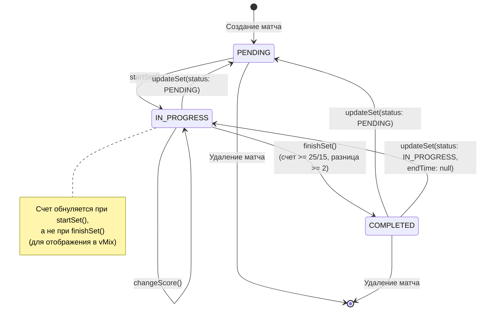
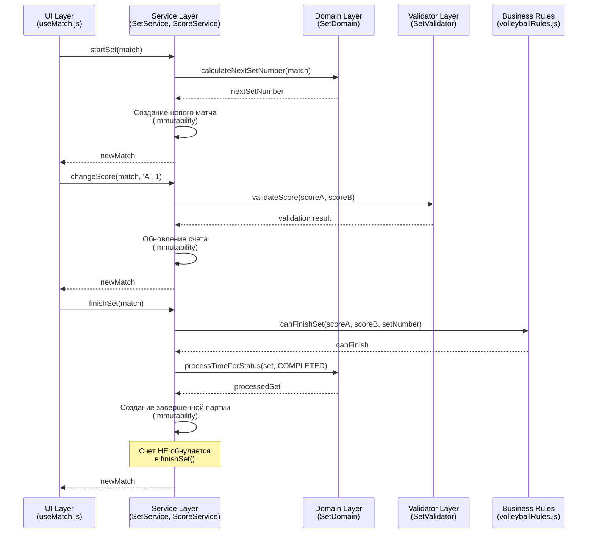
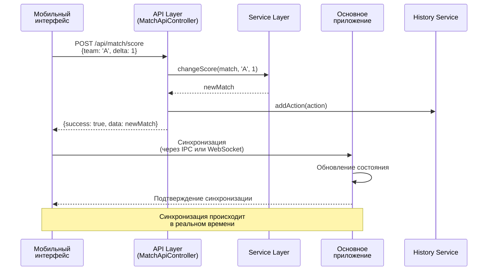
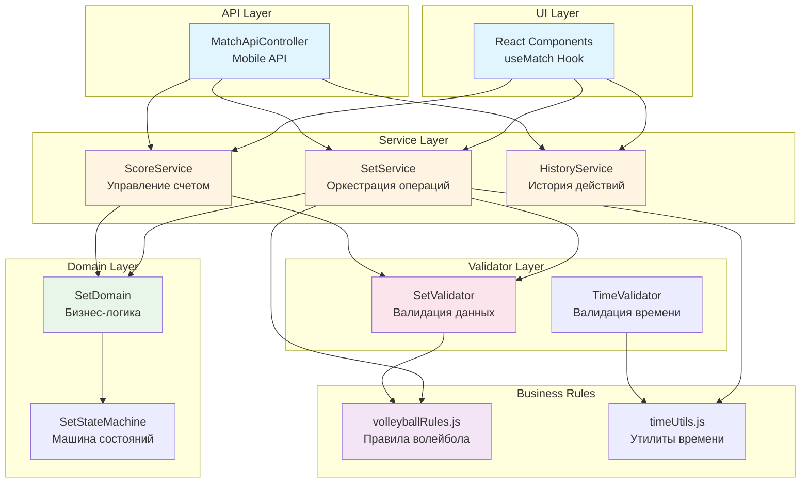
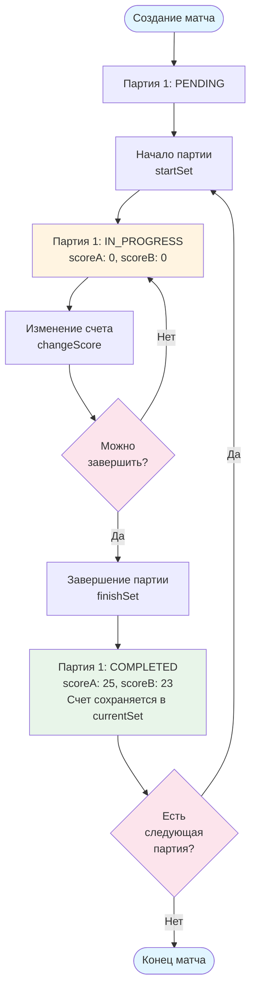
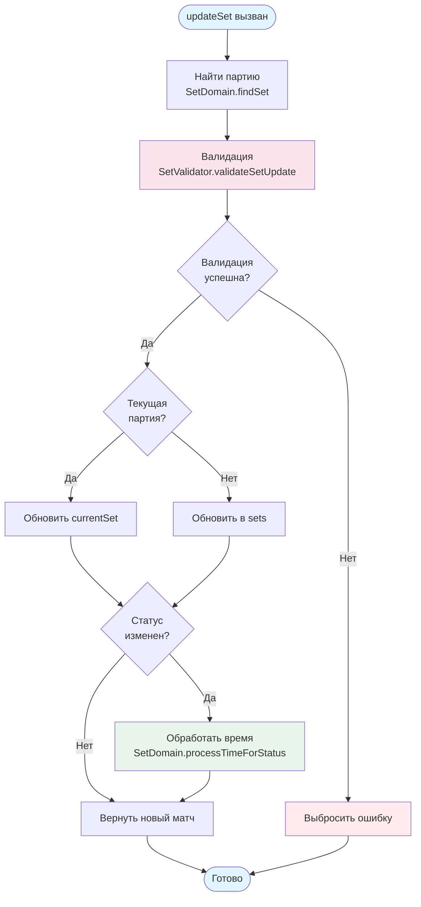
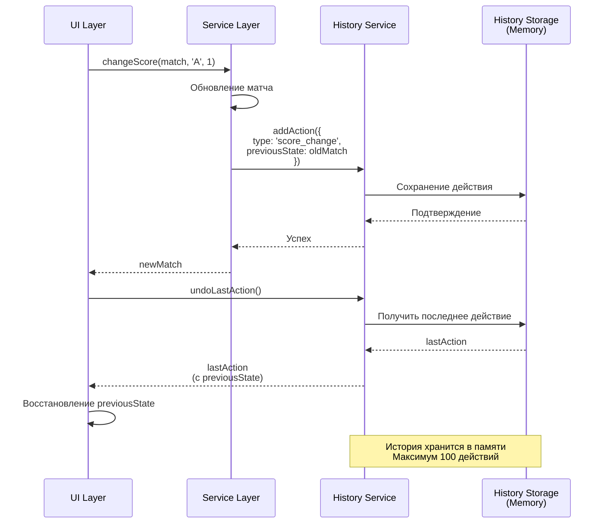

# Диаграммы архитектуры и потоков данных

Этот документ содержит диаграммы для визуализации архитектуры системы управления счетом и партиями.

## 1. Диаграмма состояний партии

## 2. Диаграмма потоков данных (UI → Domain Layer)

## 3. Диаграмма синхронизации с мобильным API

## 4. Архитектурная диаграмма слоев

## 5. Диаграмма жизненного цикла матча

## 6. Диаграмма обработки обновления партии

## 7. Диаграмма работы с историей действий

## Примечания

- Все диаграммы созданы с использованием Mermaid
- Диаграммы отражают текущую архитектуру после рефакторинга
- Для обновления диаграмм используйте Mermaid Live Editor: https://mermaid.live/
